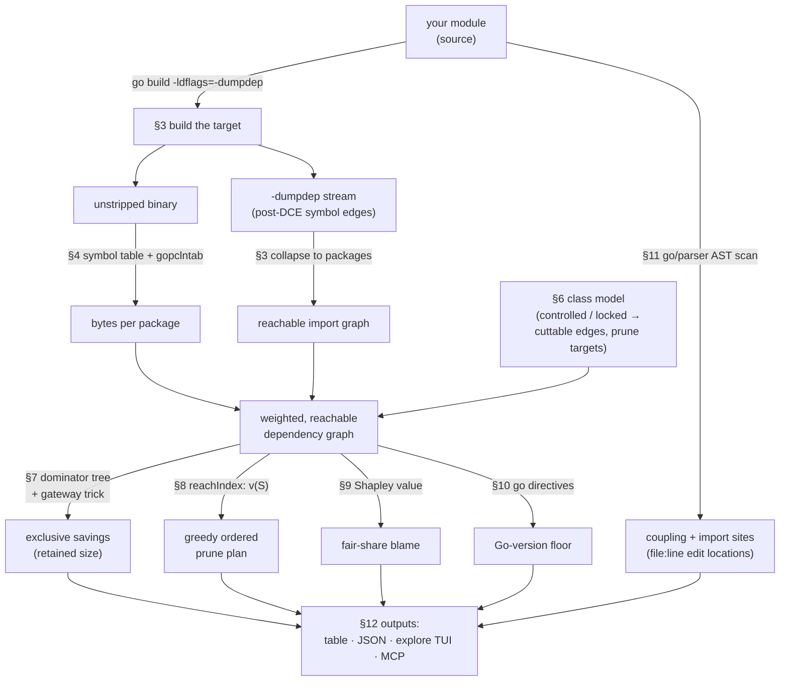
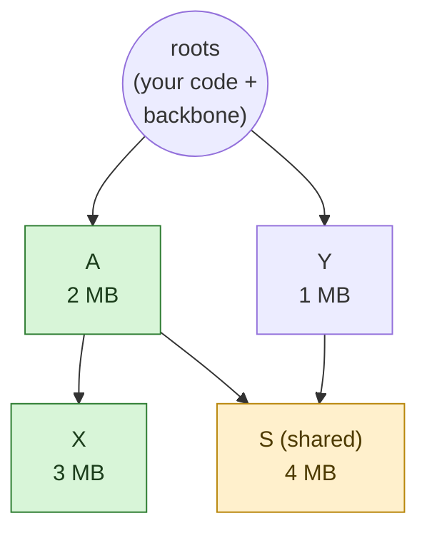

# How bonsai works

This document explains the ideas underneath bonsai, end to end. It's meant to be read
start to finish: each section builds on the one before it. The goal is that by the end
you understand not just *what* bonsai reports, but *why* those numbers are the right ones
and where they come from.

The short version: **bonsai treats your binary like a memory heap and your dependencies
like objects on it, then borrows the exact math a memory profiler uses to answer "how much
would I save if this went away?"** Everything below is an elaboration of that one sentence.

## The pipeline at a glance

Here is the whole tool in one picture. Each box is a section below; the arrows are what
flows between them.



The left spine (build → graph + sizes) is *getting honest data*. The class model decides
*what you're even allowed to cut*. The four analyses in the middle are *the math*, all of
it reading off the same weighted graph. The bottom is *how you read it*.

---

## 1. The question, and why the obvious answer is wrong

You add a dependency to do one small thing. It brings its own dependencies, those bring
more, and soon a single line in your `go.mod` is responsible for a surprising chunk of
your binary. The natural question is: *if I drop this dependency, how much smaller does my
binary get?*

The natural (wrong) way to answer it is to measure how big the dependency is and call that
the savings. "This module is 8 MB, so removing it saves 8 MB."

That's almost never true, for one reason: **most of a dependency's weight is shared.** The
8 MB module probably pulls in `math/big`, some encoding library, a logging package, and
several of *those* are also pulled in by other dependencies you have no intention of
dropping. If you remove the 8 MB module, the shared pieces stay, because something else is
still holding them in. The real savings is only the part that *nothing else needs*.

So the question isn't "how big is this dependency?" It's "how much is being kept alive
**only** by this dependency?" That distinction is the whole game, and it turns out to be a
very old, very well-studied problem in disguise.

---

## 2. The analogy that makes it tractable: your binary is a heap

Here is the key reframing. Think about how a garbage collector and a memory profiler see a
running program:

- The program has **objects** in memory.
- Objects hold **references** to other objects.
- A handful of objects are **roots** (globals, stack variables), always reachable.
- An object stays alive as long as some path of references reaches it from a root.
- When you ask a profiler *"how much memory frees if I drop this object?"*, it doesn't tell
  you the object's own size. It tells you the object's **retained size**: the object plus
  everything that would become unreachable along with it, i.e. everything *only it* was
  keeping alive.

Now map that onto a compiled Go binary:

| Garbage-collected heap            | Go binary (bonsai)                          |
|-----------------------------------|---------------------------------------------|
| object                            | package                                     |
| reference (object → object)       | import edge (package → package)             |
| GC roots                          | program entrypoints + the "backbone"        |
| object is reachable from a root   | package is linked into the binary           |
| bytes freed if object collected   | bytes freed if dependency pruned            |
| **retained size** of an object    | **exclusive prune savings** of a dependency |

This isn't a loose metaphor; the structures are genuinely the same, so the algorithms
that solve the heap problem solve the binary problem unchanged. "Retained size" is exactly
the realistic savings number we wanted in section 1: it credits shared weight to *nobody*,
because shared weight doesn't disappear when one of its several holders leaves.

The rest of this document is, essentially, the work of making this mapping precise:
getting an accurate graph, defining "roots" correctly, defining what a "prune" even is,
and then reading the retained sizes off.

---

## 3. Ground truth: build it, don't guess from `go.mod`

Before any of the analysis can run, bonsai needs an accurate picture of what is *actually*
in your binary. There are two traps to avoid:

1. **`go.mod` lies about reach.** Your `go.mod` lists modules, but the linker only keeps
   the *code paths that are actually used*. A module can be in your `go.mod` and contribute
   almost nothing, because dead-code elimination (DCE) stripped the parts you never call.
   Analyzing the source-level import graph systematically over-counts.

2. **Source-level call graphs are approximations.** Academic debloating tools build a
   static call graph and reason about what *might* be reachable. That's conservative; it
   has to assume more is live than really is, to stay safe.

bonsai sidesteps both by **compiling the target itself** and reading the linker's own
answer. When it builds, it passes `-ldflags=-dumpdep`, which makes the Go linker emit the
exact symbol-to-symbol reference graph it used *after* dead-code elimination. This is
ground truth: it's the reachability the linker actually computed to decide what to put in
the binary. (See `build.go` and `dumpdep.go`.)

A few details that matter for accuracy:

- The dump is at the **symbol** level (`pkg.Func → otherpkg.Func`). bonsai collapses each
  edge down to the **packages** owning the two symbols, and keeps only edges between
  packages it already knows about. The result is a tighter, more honest import graph than
  `go list` would give; imports the linker dropped simply aren't there.
- It throws away **compiler scaffolding** edges (argument metadata, stack maps, deferred-
  call bookkeeping), because those create cross-package references that aren't real calls
  and would falsely pin modules as "always reachable."
- It drops a subtle artifact: an edge that appears to go *from a standard-library package
  to a third-party module*. That can't happen in real source; it shows up when a generic
  defined in stdlib is instantiated with an external type, and the resulting symbol is
  named after the stdlib package. Left in, it would make external modules look permanently
  reachable and zero out their prune savings.

If you'd rather not build (or you only have the artifact), you can point bonsai at a
prebuilt binary instead; it then falls back to the source-level import graph for
reachability. But the default path, build it ourselves, is what gives the exact numbers.

---

## 4. Putting bytes on the graph: size attribution

The graph tells us what's connected. We also need to know **how many bytes each package
weighs**, so retained sizes come out in megabytes and not just node counts. This is
`binary.go`, and it works directly on the compiled artifact.

The richest case is an **unstripped** binary (which is what bonsai produces when it builds
for you):

- The binary's **symbol table** lists every function and named global with its address.
  bonsai sorts symbols by address within each section and takes the gap to the next symbol
  as that symbol's size, a standard "delta fill" trick. Each symbol's bytes are charged to
  the package its name belongs to. This is exact for executable code and all named data.
- On **Mach-O and ELF**, one section, **`gopclntab`** (the function metadata table the
  runtime uses for stack traces and the like), isn't owned by any one package. bonsai
  distributes it across packages *in proportion to their code size*: a package with 10% of
  the code gets 10% of the pclntab. It's an approximation, but a principled and stable one.
  (On **PE/Windows** there's no separate pclntab section, so those bytes fall into `.rdata`
  and get attributed by the same delta-fill below.)
- A small amount of weight genuinely can't be attributed: anonymous pooled constants
  (notably protobuf descriptors) that have no symbol. With no symbol of their own, these
  bytes are picked up by the delta-fill above and charged to the nearest preceding
  symbol, which is often the `<generated>` bucket rather than a real package, so they're
  not misattributed to whoever happens to sit next to them.

If the binary is **stripped** (little or no symbol table), bonsai degrades gracefully: it recovers
*code* sizes from the `gopclntab` function table via `debug/gosym` (which survives
stripping) and leaves data unattributed. You still get meaningful code-size attribution.

This all works across **Mach-O (macOS), ELF (Linux), and PE (Windows)** through a small
format-agnostic adapter, so the rest of the tool never has to care about binary formats.

The output of this stage is a map: *package import path → attributed bytes*. Combined with
the graph from section 3, we now have a weighted, accurately-reachable dependency graph.
Everything from here is analysis on that graph.

---

## 5. Reachability is the GC mark phase

With a weighted graph in hand, the foundational operation is: **given the roots, what's
alive?** This is literally a tracing garbage collector's mark phase. Start at the roots,
follow every edge, and mark everything you can reach. Whatever you marked is "live" (in the
binary); whatever you didn't is gone. (See `reachable` in `treeshake.go`.)

The clever part is what a "prune" *is* in this model. Pruning module B doesn't mean
deleting B's nodes. It means: **the code you control stops importing B.** So bonsai
computes reachability with a twist: when it traverses, it refuses to follow any edge that
goes *from code you control* *into a module you've decided to cut*. Everything that was
only reachable through those now-severed edges falls out of the marked set. The bytes that
were marked before but aren't marked after are exactly your savings.

This is the honest, from-scratch way to answer "what does this cut free?": re-mark the
graph with some edges forbidden, and diff. It's also the **oracle**: it's slow to run for
every possible cut, but it's obviously correct, so bonsai's faster machinery (sections 7-9)
is tested against it.

This framing is *tree-shaking*, not dead-code elimination: we additively keep what's
reachable from roots, rather than subtractively removing what looks unused. The reachable
set is the live set; the prunable set is everything reachable *only* through edges you're
allowed to cut.

---

## 6. Who can you actually cut? The class model

Section 5 mentioned "code you control" and "modules you're allowed to cut." Those aren't
vague; they're a precise classification that everything else derives from. (See
`classify.go`.)

The question bonsai needs to answer isn't "is this dependency used at all?" (a yes/no) but
"which import edges could you realistically stop writing?" An edge is **cuttable** if and
only if it leaves a module whose **source you control** and lands on a module that isn't
**locked** (off-limits). From that single definition, four classes fall out automatically:

- **1st-class**: code you control. Always your main module, plus anything you mark with
  `--controlled` (your org's libraries, a fork you maintain). bonsai never proposes pruning
  these; instead it looks for imports to cut *out of* them.
- **2nd-class**: a dependency your 1st-class code imports *directly*. These are the real
  prune candidates: the imports you could plausibly stop writing.
- **3rd-class**: a dependency reached *only through* other dependencies. You can't drop it
  directly; it leaves only when whatever pulls it in leaves. Most of your graph lives here.
- **locked**: explicitly off-limits, never suggested. Everything 1st-class is locked by
  default; `--lock` locks more, `--unlock` re-opens a locked module (yours or a dependency)
  as fair game.

You only ever *declare* two things: which modules are controlled, and which are locked.
The 1st/2nd/3rd taxonomy and the set of **prune targets** (non-locked modules with a
cuttable edge into them) are *derived* from the graph structure. You never hand-maintain
them.

Two things are worth internalizing here:

1. **It's a strict generalization.** If you set "controlled = {just the main module}", the
   model collapses exactly to the old, familiar "which direct dependencies can I drop?"
   behavior. Widening `--controlled` is the one knob that opens up everything deeper.
2. **The real wins usually hide a layer down.** Widening `--controlled` promotes a whole
   layer of 3rd-class deps into 2nd-class candidates. "My fork of X could stop importing Y"
   is often where the big savings are, a level or two below your `go.mod`, invisible to a
   tool that only looks at direct dependencies.

Back in the GC analogy, the literal roots stay just your program's entrypoints (the `main`
packages). But a **backbone** *behaves* like an extra set of roots: all your controlled
code, every locked dependency, and the shared standard library. The reason is the cut model
from section 5, a cut only severs edges that leave *controlled* code and land on a *target*,
so the backbone's own out-edges are never cuttable. Anything the backbone reaches is
therefore pinned no matter what you prune, giving it zero prunable size *by construction*,
exactly like a GC root that holds memory no matter what else you free. That's the right
behavior: weight held up by stuff you'll never remove isn't really prunable.

---

## 7. The exact savings number: dominator trees

Now we can finally compute the realistic per-dependency savings from section 1, the
"retained size", *efficiently*, instead of re-running the mark phase once per candidate.

Memory profilers (Chrome DevTools, Eclipse MAT, dotMemory) solve this with a **dominator
tree**. The defining idea: node *d* **dominates** node *v* if *every* path from a root to
*v* passes through *d*. The **retained size** of *d* is its own size plus everything it
dominates: precisely the weight that becomes unreachable if *d* goes away. Crucially, a
dependency shared by two consumers is dominated by *neither* (paths reach it two ways); it's
dominated by the shared super-root above them both. So its bytes are credited to nobody
alone, which is exactly the realism we wanted: shared weight doesn't free when one holder
leaves. (See `dominator.go`.)

bonsai builds this dominator tree once over the reachable graph and reads every
dependency's exclusive savings straight off it in a single pass. No per-candidate
re-marking.

To see why shared weight ends up credited to nobody, picture two dependencies **A** and
**Y** that you control imports into. **A** alone pulls in **X**; both **A** and **Y** pull
in the shared library **S**:



Every root → **X** path goes through **A**, so **A** *dominates* **X**: pruning A frees X.
But **S** is reachable two ways (through **A** *or* through **Y**), so **A** dominates
neither S's path. S is dominated by the shared point above both (the super-root). The
consequence:

- **Prune A alone → frees A + X = 5 MB.** That's A's exclusive (retained) savings. S stays,
  because Y still holds it.
- The 4 MB of **S is credited to neither A nor Y by itself**; it only frees if *both* go.
  bonsai reports it as A's *shared* weight, with Y named as the co-holder.

That's the whole point of using retained size instead of raw size: A's honest number is
5 MB, not 9 MB, and the tool tells you S is the 4 MB you'd unlock by dropping Y too.

There's one wrinkle that makes bonsai's version richer than a textbook heap profiler. In a
heap, "free X" means deleting *one node*. In bonsai, "prune B" means cutting a *set of
edges*: every import of B that originates in code you control. A dominator tree natively
handles single-node removal, not edge-set removal. bonsai bridges the gap with a small
trick: for each prune target B, it inserts a synthetic **gateway node** and reroutes all of
B's cuttable in-edges through it. Now "remove the gateway" means exactly "cut all those
edges": the edge-set cut becomes a single-node removal, and the dominator tree handles it
without modification. The retained size of B's gateway *is* B's exclusive prune savings.

For the dominator computation itself, bonsai uses the **Cooper–Harvey–Kennedy** iterative
algorithm ("A Simple, Fast Dominance Algorithm", 2001). It's not the asymptotically optimal
choice, but at bonsai's scale (hundreds to a few thousand packages) it beats the fancier
Lengauer–Tarjan in practice and is far easier to implement correctly.

**Correctness is pinned by a test, not by trust.** The dominator-derived exclusive savings
for every target must equal what the slow-but-obviously-correct tree-shake oracle from
section 5 reports. If the fast path and the oracle ever disagree, the test fails. This is
the single most important guardrail in the codebase.

This stage produces, for each prune candidate:

- **FreedBytes**: the exclusive, dominated savings, what you *actually* bank by pruning
  this one target alone.
- **PotentialBytes**: the freeable weight in its whole subtree, what *could* come back if
  this target *and* everything sharing its subtree were all pruned together.
- **SharedBytes**: the difference, freeable weight that stays put because other targets
  reach it too (with `SharedWith` naming those other targets, so you can see who to
  co-prune).

That three-number split is the honest story: "you save *this* much by yourself, *this* much
more is theoretically there but shared, and here's who you'd have to drop alongside to get
it."

---

## 8. Prunes interact: ordering the plan

Exclusive savings answer "what does pruning B *alone* free?" But in practice you prune
several things, and they interact: a shared dependency only frees once the *last* thing
holding it is gone. So "prune A saves 5 MB, prune B saves 4 MB" does **not** mean pruning
both saves 9 MB; they might share weight that only one of them gets credited for once both
are cut.

To produce a realistic *plan*, bonsai needs to evaluate counterfactuals quickly: "if I cut
this whole *set* of targets, how many bytes go away?" Re-running the section-5 mark phase
for every set would work but is wasteful when you ask it thousands of times. So bonsai
compiles the reachable graph into an **integer-indexed structure** (`reachindex.go`) where
each cuttable edge is tagged with the target it depends on. Answering "what frees if I cut
set S?" becomes a single fast graph sweep that skips the tagged edges; call it `v(S)`, the
value of cutting coalition S.

With cheap `v(S)` in hand, the plan is built **greedily**: repeatedly pick the target with
the largest *marginal* saving given everything already chosen, take it, repeat (up to a cap
of the top ~25 steps, since the tail savings vanish). Each step reports:

- the **marginal** bytes it frees (on top of prior steps) and the running **cumulative**,
- a breakdown of *where* those bytes come from: the target's **own code** versus the
  modules it **drags out** with it (newly orphaned dependencies), largest first,
- for each dragged-out item, the **co-prune** set: the *other* targets you'd also have to
  cut to free it (empty if this prune frees it alone).

Why greedy, and why is that defensible? Because retained size is a **submodular** set
function (diminishing returns: a target frees less the more you've already cut). For
submodular maximization, greedy carries the classic **(1 − 1/e) ≈ 63%** optimality
guarantee, so the greedy order isn't just a heuristic, it's provably close to the best
possible ordering. In practice it surfaces exactly the realistic "prune A for 9 MB, then B
frees another 4 MB net" sequence you'd want to follow.

The co-prune computation is careful to use the *real* cut machinery rather than a shortcut.
A naive "anything that can reach this item must be co-pruned" over-counts, because it
includes controlled code whose path runs *through* the module you're already pruning (that
edge gets cut anyway). Instead, bonsai asks the honest question: un-cut a candidate target,
does the item come back? If yes, it was genuinely necessary. That's what keeps "prune
go-sdk → 1.1 MB" reading as one clean action instead of a noisy list of spurious
"also prune X" requirements.

---

## 9. Fair blame: the Shapley value

There's a tension between two of the numbers above. Exclusive savings (section 7) credit
shared weight to *nobody*, which is honest for "what do I save right now," but it means the
exclusive numbers *don't add up to the real total*. If A and Y both pull in a 3 MB
dependency, that 3 MB is charged to neither, so summing exclusive savings undercounts what's
actually prunable.

Sometimes you want the other view: *"counting its fair share of everything it drags in, what
is this dependency really costing me?"*, and you want those shares to sum to the true total.
This is a cost-sharing problem, and cooperative game theory has *the* answer: the **Shapley
value** (`shapley.go`).

Model pruning as a cooperative game. The players are the prune targets. The value of a
coalition S is `v(S)`, the bytes freed by pruning that set (the same fast function from
section 8). The Shapley value asks: averaged over *every possible order* in which the
targets could be removed, how much does each target contribute *at the moment it's added*?
A shared dependency's weight naturally splits among the targets that hold it, because each
one is "the one that finally frees it" in some fraction of orderings.

The Shapley value is the **unique** allocation satisfying four fairness axioms:
*efficiency* (shares sum to the true total prunable weight), *symmetry* (equal contributors
get equal blame), *null-player* (contribute nothing, get nothing), and *additivity*. That
uniqueness is why it's the principled choice and not just one option among many.

The catch: computing it exactly means summing over all 2ⁿ coalitions, which is
intractable in general. Two facts rescue it at bonsai's scale:

- For **few targets** (≤ 12), bonsai just enumerates all coalitions exactly: 2¹² = 4096
  evaluations of the cheap `v(S)`, no problem.
- For **more**, it switches to the standard **Monte-Carlo permutation estimator**: sample
  random removal orderings and average each target's marginal contribution. Because the
  marginals along any single ordering telescope to `v(all)`, the estimates always sum to
  the true total and converge quickly. The sampler is seeded with a fixed value so blame is
  reproducible across runs.

Blame is opt-in (`--blame`) because most of the time the exclusive "what do I save now"
number is what you want; the Shapley split is for when you want the accounting to balance.

---

## 10. The second goal: lowering your `go` version floor

Size isn't the only thing dependencies inflate; they also push up the minimum Go version
you must declare. Go requires your main module's `go` directive to be at least as high as
every module in your build. So your floor is set by the **highest `go` directive among the
dependencies you don't control.** (See `goversion.go`.)

bonsai computes this floor over exactly the modules currently in the build, and reports:

- **Version**: the dep-imposed floor (the highest `go` line among non-owned modules).
- **Critical**: the modules pinned *exactly* at that floor. These are the reason for it;
  prune all of them and the floor drops.
- **NextVersion**: where the floor would land if you pruned every Critical module.
- **OwnedMax**: the highest directive your *own* modules already declare, so you can see
  the headroom you can reclaim *right now* (just lower your `go` line) versus what pruning
  would buy you.

The elegant part: lowering the floor is the *same lever* as pruning for size. Dropping a
module removes it from the build, which is exactly what can let the floor fall. So in the
interactive explorer, the floor recomputes live as you deselect modules: one action, two
payoffs. The `inspect` command reports this as a **FloorDelta**: prune *this* module, does
the floor move?

---

## 11. The third signal: how hard is it to actually cut?

A dependency can be a huge size win and still not be worth removing if your code is wired
deeply into it. So bonsai measures **coupling** as a proxy for removal effort; lower
numbers mean easier to prune. (See `coupling.go`.) For each dependency it counts:

- how many distinct first-party **packages** import it,
- how many total **import statements** reference it,
- how many distinct **symbols** of it your code actually uses.

Symbol counting is a deliberately cheap syntactic approximation (matching `alias.Symbol`
selector expressions against each file's imports, no full type resolution), exact enough
to *rank* coupling depth, which is all it's for.

Closely related, and aimed at automation, is the **import-site** map: the concrete
`file:line` locations of every first-party import of a given module, the actual edit
locations you'd change to sever it. This is what powers the `inspect` command and the MCP
`bonsai_locate_cuts` tool: instead of "this dep is worth cutting," an agent gets "here are
the four files and lines to edit, and here's how much weight each entry package accounts
for," so a partial rewrite can be scoped to the parts that are actually worth it.

That per-entry-package weight comes straight back from the dominator tree of section 7: the
**children of a target's gateway** are exactly the packages of it that first-party code
imports directly, and each child's retained size is the weight reachable *only* through that
one entry package. So "stop importing this specific package" gets its own honest savings
number, not just the module as a whole.

---

## 12. Four ways to read the same analysis

Everything above is one analysis pipeline. It's surfaced in whatever form fits the reader:

- **Tables** (default): the quick terminal read, the single best win, then a ranked,
  ordered prune plan with the own-code-versus-dragged-out breakdown.
- **JSON**: the same data for scripts, CI gates, and your own tooling.
- **The `explore` TUI**: for *grokking*. Everything starts checked; uncheck a dependency
  and watch the projected size and Go floor update instantly, with side panes showing what
  actually leaves, what survives (and who's keeping it), and *why* each module is in the
  build at all. You can reclassify modules on the fly and watch the candidate set move. The
  prune set isn't applied (enter just prints it), but lock/class edits are saved to
  `.bonsai.yaml` — the single source of truth shared with `bonsai config lock` and every other
  command — and your what-if selection is remembered per scanned module.
- **MCP** (`bonsai mcp`): for an AI agent editing your codebase. Each tool is the JSON of
  one focused analysis (biggest wins, the Go floor, the concrete edit sites for a given
  module, the current size shape, and a cheap re-measure after an edit). Builds are cached
  and re-run when the source changes, so an agent's edit → measure loop just works.

---

## 13. The intellectual lineage, briefly

bonsai's contribution isn't inventing new algorithms; it's recognizing that three
well-studied problems are the *same* problem wearing different clothes, and joining three
signals no single existing tool combines (size, prune savings, and coupling):

- **Reachability / debloating.** Academic tools (DepClean and the Soto-Valero et al. study
  of bloated Maven dependencies; Google's Capslock for Go) build *static* call graphs and
  ask whether a dependency is used. bonsai reads *exact post-DCE* reachability straight from
  the linker, and frames the question as *which edges can I cut?* rather than yes/no.
- **Attribution = retained size.** Lifted wholesale from heap profilers (Chrome DevTools,
  Eclipse MAT, dotMemory) and their dominator-tree machinery. The super-root trick for
  multi-root heaps is exactly how bonsai handles "weight held up by the backbone."
- **Counterfactuals.** Decremental reachability for the cut queries; submodular maximization
  (with its (1 − 1/e) greedy guarantee) for the ordered plan; the Shapley value (Shapley
  1953; Castro et al. on polynomial Monte-Carlo estimation) for fair cost-sharing.

The whole thing is *tree-shaking in the additive sense* (keep what's reachable from roots),
applied to a dependency graph, with the reachable set understood as a GC live set. Once you
see that the binary is a heap, the rest is reading numbers off structures the literature
already knows how to build, and checking the fast structures against a slow, obviously-
correct oracle every step of the way.

---

*For the canonical, code-anchored version of this reasoning, see the package doc:*

```sh
go doc ./internal/bonsai
```
